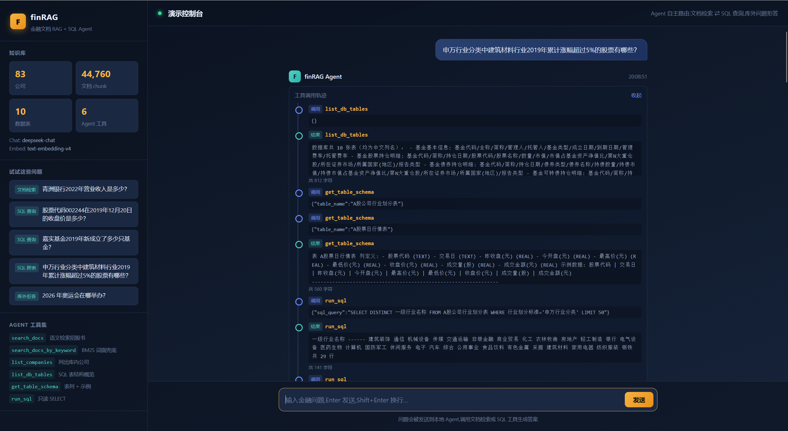

# finRAG

金融文档 RAG + SQL 双工具问答系统。基于 LangGraph ReAct Agent，让大模型自主决定：何时检索招股说明书、何时查询结构化金融数据库、何时换 query 重检索、何时作答。对 2023 年博金杯比赛方案中 C01→C03 文档链路的现代化重构。

## 能力概览

- **文档问答**：对 80 份招股说明书做语义检索 + BM25-lite 关键词兜底，答案带 `[来源: 文件名#chunk_id]` 引用，专名/数字/精确指标命中率高。
- **结构化问答**：直接 SQL 查询大赛 SQLite 金融库（10 张中文表：A 股/港股票行情、基金持仓/净值/规模/持有人结构、行业划分等）。
- **自主路由**：Agent 根据问题性质自主选择检索或 SQL，库外问题明确拒答，不编造数据。
- **批量评测**：支持 JSONL/CSV 批量问答，并发 + 断点续跑，输出 `results.csv`。
- **前端演示**：单页聊天式 UI（深色金融科技风），展示工具调用轨迹、最终答案、引用溯源、耗时统计。
- **本地评测**：自建 100 题验证集，注入官方评分逻辑离线打分，便于相对趋势对比。

## 技术栈

- LangChain 1.4 + LangGraph 1.2（`create_react_agent` + Tool Calling）
- Chroma 持久化向量库（`langchain-chroma`）
- OpenAI 兼容 API（Chat / Embedding 可指向不同服务，可插拔 DeepSeek / Qwen / GLM / vLLM / Ollama）
- Python 3.13（项目内 venv）
- 前端零依赖：Python 标准库 `http.server` + 原生 HTML/CSS/JS

## 目录结构

```
finRAG/
├── rag_v2/                      # 主源码包
│   ├── config.py                # 配置加载 + LLM/Embedding 客户端工厂
│   ├── ingest.py                # 文档入库：加载→切分→embedding→增量写入 Chroma
│   ├── retrieve.py              # 向量检索 + BM25-lite 关键词检索（进程内缓存）
│   ├── sql_tools.py             # SQL 工具（只读、单条 SELECT、行数/超时约束）
│   ├── tools.py                 # Agent 可用工具集合（检索类 + SQL 类）
│   ├── agent.py                 # LangGraph ReAct agent 组装与问答入口
│   ├── ask.py                   # 问答 CLI（单问 / 批处理 / 断点续跑）
│   ├── prompts.py               # system prompt：检索约束、引用格式、拒答策略、纯中文输出
│   ├── evaluate.py              # LLM 裁判抽样评估
│   ├── _smoke_test.py           # 离线冒烟测试（不调外部 API）
│   └── test_chat.py             # Chat 模型最小连通测试
├── web/                         # 前端演示
│   ├── server.py                # 后端：复用 rag_v2.agent 的 build_agent() + astream
│   ├── __init__.py              # 包标识
│   └── static/index.html        # 单页聊天式 UI
├── eval/                        # 自建验证集 + 本地官方评分
│   ├── build_valset.py          # 分层抽样 100 题建金标
│   ├── run_local_eval.py        # 跑答案 → 注入 text2vec → 调官方 evaluate()
│   ├── evaluate.py              # 官方评分逻辑（answer_term + F1 + text2vec）
│   ├── standard_answer.jsonl   # 100 题金标答案
│   ├── configs/emb_config.yaml # 评测 embedding 配置
│   └── models/text2vec-base-chinese  # 官方语义模型（HF 镜像下载）
├── data/sample_docs/            # 3 个样本文档（6 chunk）
├── bs_challenge_financial_14b_dataset/
│   ├── pdf_txt_file/            # 80 份招股说明书预提取 txt（入库源）
│   ├── dataset/博金杯比赛数据.db # SQLite 金融库（2.18GB，10 张表）
│   └── question.json            # 1000 道 JSONL 题目（id + question）
├── vectorstore/                 # 持久化 Chroma（全量入库后约 4.4 万 chunk）
├── output/                      # 批量评测与评估输出（results.csv、eval_report.json 等）
├── .env / .env.example          # 配置
└── README.md
```

## 快速开始

### 1. 环境配置

```powershell
# 建议用项目内 venv（Python 3.13）
python -m venv finrag
.\finrag\Scripts\Activate.ps1
pip install langchain langgraph langchain-chroma langchain-openai langchain-text-splitters python-dotenv chromadb pypdf
```

复制 `.env.example` 为 `.env` 并填入：

```env
OPENAI_BASE_URL=https://api.deepseek.com/v1     # Chat 端点（任意 OpenAI 兼容）
OPENAI_API_KEY=sk-xxx
CHAT_MODEL=deepseek-chat

# Embedding 可指向与 Chat 不同的服务（DeepSeek 无 embedding 接口）
EMBEDDING_MODEL=text-embedding-v4
EMBEDDING_BASE_URL=https://dashscope.aliyuncs.com/compatible-mode/v1
EMBEDDING_API_KEY=sk-xxx

# 可选：覆盖默认路径
# VECTORSTORE_DIR=./vectorstore
# DOCS_DIR=./data/sample_docs
# DB_PATH=./bs_challenge_financial_14b_dataset/dataset/博金杯比赛数据.db
```

> 换 embedding 模型后**必须** `python -m rag_v2.ingest --reset` 重建库。

### 2. 验证连通

```powershell
python -m rag_v2.test_chat        # 验证 Chat 模型可正常返回
python -m rag_v2._smoke_test      # 离线冒烟：ingest→retrieve→tools→SQL 全链路（不调外部 API）
```

### 3. 文档入库

```powershell
# 仅入库样本（6 chunk，秒级完成）
python -m rag_v2.ingest

# 全量入库：80 份招股说明书，约 4.4 万 chunk（首次约 35 分钟，1000 条/批）
python -m rag_v2.ingest --data-dir "bs_challenge_financial_14b_dataset/pdf_txt_file"

# 换 embedding 模型后清空重建
python -m rag_v2.ingest --reset
```

入库特性：
- 稳定 `chunk_id`（内容哈希）保证增量去重，重跑只补差量；写入前按 id 去重规避 `DuplicateIDError`。
- 公司名解析优先级：`--company-map` CSV → 文档首行 `# 公司：XXX` → 正文启发式抽取（封面/名称锚点/高频机构名兜底，含 OCR 截断修复）→ 文件名。
- 大库分页拉取（5000/批），规避 Chroma `too many SQL variables`。

### 4. 问答 CLI

```powershell
# 单问（带工具调用轨迹）
python -m rag_v2.ask "青洲银行2022年营业收入是多少？" --verbose

# 文档题（自动路由到检索）
python -m rag_v2.ask "恒信精密的主要原材料是什么？"

# 结构化题（自动路由到 SQL）
python -m rag_v2.ask "股票代码002244在2019年12月20日的收盘价是多少？"

# 批量评测（JSONL/JSON/CSV，支持断点续跑、并发 6）
python -m rag_v2.ask --batch bs_challenge_financial_14b_dataset/question.json --out output/results.csv --concurrency 6
```

CLI 参数：
- `question`：单个问题
- `--batch PATH`：批量问题文件（`.jsonl`/`.json` 每行 `{"id": n, "question": "..."}`，或含 `问题` 列的 CSV）
- `--out PATH`：批处理输出路径（默认 `results.csv`）
- `--max-questions N`：仅跑前 N 题
- `--concurrency N`：批处理并发数（默认 6）
- `--verbose`：打印 agent 工具调用轨迹

输出 CSV 列：`id, 问题, 答案, 引用来源, 工具调用次数`，同时落 `<out>.progress.jsonl` 供断点续跑（ERROR/递归保护话术视为未完成，自动重跑）。

### 5. 前端演示



```powershell
finrag\Scripts\python.exe -m web.server              # 默认 127.0.0.1:8000
finrag\Scripts\python.exe -m web.server --host 0.0.0.0 --port 9000
```

访问 http://127.0.0.1:8000/，功能：
- **侧边栏**：库统计（公司数 / chunk 数 / 数据表数 / 模型配置）、6 个示例问题、工具集说明
- **聊天主区**：用户消息气泡 + Agent 回复，含工具调用轨迹（步骤名 + 参数 + 结果预览）、最终答案、引用溯源、耗时统计
- **响应式布局**：窄屏自动隐藏侧边栏

API 路由：

| 方法 | 路径 | 说明 |
|---|---|---|
| GET | `/` | 首页 `index.html` |
| GET | `/api/stats` | 库统计（公司数 / chunk 数 / 数据表数 / 配置） |
| GET | `/api/examples` | 示例问题 |
| POST | `/api/ask` | `{question}` → `{answer, citations, steps, elapsed_ms}` |

## Agent 工具集

| 工具 | 用途 |
|---|---|
| `search_docs` | 语义检索文档库，可按 `company` 定向过滤 |
| `search_docs_by_keyword` | 指定公司内 BM25-lite 词面检索（汉字二元组，约 0.1s/查）；语义检索未命中时的兜底，专找精确指标/数字/专名 |
| `list_companies` | 列出库中所有公司全称 |
| `list_db_tables` | 列出 SQLite 金融库 10 张表及列摘要 |
| `get_table_schema` | 查看指定表完整列定义 + 3 行示例数据 |
| `run_sql` | 执行只读 SELECT，返回结果表格 |

SQL 工具安全约束：
- `mode=ro` 只读连接，仅允许单条 `SELECT`/`WITH`
- 返回行数上限 30，超出截断并提示收窄条件
- 60s progress handler 超时中断
- 列名含括号须双引号（如 `"收盘价(元)"`）；代码类值须加引号保留前导零（如 `股票代码='002244'`）

## 数据规模与实测

- 全量入库：**44760 条 chunk / 83 家公司**（80 发行人 + 3 样本），公司名零解析失败。
- 全量评测：**1000 题，0 异常**（400 文档题带引用 + 600 SQL 题），1 题因官方 txt 中 `<|TABLE_*.xlsx|>` 占位符无数据而拒答。
- SQL 真值抽样核验全部一致（如 `002244` 收盘价 4.670、嘉实 2019 新成立基金 55 只、申万建筑材料涨幅>5% JOIN 题 2 只等）。
- 复杂题（全年日均收益率 JOIN 行业表、基金重仓股收益）需 12-21 步，`RECURSION_LIMIT=40`。
- 检索改进：语义检索对直述问句式排序差（gold chunk 排 15-22，k=6 漏召回），新增关键词检索兜底后 10 个原拒答题修复 9 个。

## 评测

### 1. LLM 裁判抽样评估

脚本 `rag_v2/evaluate.py`：裁判 agent 独立用工具（SQL/文档检索）查证，再与原答案比对，输出 `correct` / `partially_correct` / `incorrect` / `unverifiable`。

```powershell
python -m rag_v2.evaluate --sample 30 --out eval_report.json
```

30 题分层抽样结果（文档 15 + SQL 15）：

| 判定 | 数量 | 占比 |
|---|---|---|
| correct | 28 | 93.3% |
| partially_correct | 1 | 3.3% |
| incorrect | 0 | 0.0% |
| unverifiable | 1 | 3.3% |

- 估算准确率 **95.0%**（partially_correct 计半分）
- 唯一 `partially_correct`（id 724）：答案漏列"智能监控系列芯片"，方向正确但信息不完整
- 唯一 `unverifiable`（id 338）：裁判 agent 自身撞递归上限（全年日均收益率跨表分析题），非原答案有误
- 完整报告：`eval_report.json`

### 2. 本地官方评分（自建验证集）

`eval/` 子目录复刻官方 `evaluate.py` 评分逻辑（`score = 0.6 × answer_term 子串命中率 + 0.4 × (0.6 × text2vec + 0.4 × jieba F1)`，日期先标准化），并注入本地 `text2vec-base-chinese` 离线打分。

```powershell
# 建验证集（100 题：60 SQL + 40 文档，分层抽样，seed 42）
python -m eval.build_valset

# 跑答案 + 打分
python -m eval.run_local_eval
python -m eval.run_local_eval --skip-run          # 只打分
python -m eval.run_local_eval --download-model    # 只下载 text2vec 模型
```

首轮分数（**仅看相对趋势，金标与系统同栈存在循环验证偏差**）：

| 子集 | 分数 |
|---|---|
| 全量 100 题 | **72.28** |
| SQL 60 题 | 73.52 |
| 文档 40 题 | 70.43 |
| confirmed 90 题 | 72.92 |

建集方法：
- **SQL 题**：LLM 带全表 schema 写 SQL 只读执行得金标答案
- **文档题**：引用 chunk + 重检索 LLM 抽取金标
- 与 `output/results.csv` 交叉 judge：90 confirmed + 10 review（failed 回退首跑答案）
- 每条金标附 `answer_term`（日期标准化子串校验）

踩坑记录：
- `torch` 须装 CPU 版走清华镜像（pytorch.org 直连超时）
- `eval/configs/emb_config.yaml` 必须存在否则 `import evaluate` 就崩
- HF 镜像下载须 `HF_HUB_DISABLE_XET=1` 否则 401
- Chroma 读取非线程安全，证据收集须串行

## 开发说明

- `rag_v2/agent.py` 的 `RECURSION_LIMIT` 默认 40；调复杂分析题报 "need more steps" 时可适当上调。
- `rag_v2/retrieve.py` 的关键词检索为进程内缓存（公司→全部 chunk 的 BM25 索引），约 0.1s/查。
- `rag_v2/ingest.py` 默认 `--company-map` 指向 `files/AF0_pdf_to_company.csv`，不存在则优雅跳过、走启发式。
- prompt 第 7 条强制纯中文输出；coding 风格模型可能在答案中泄漏英文思考，必要时可用"裁掉首个中文字符前英文前缀"的后处理清零（问英文名称的题除外）。
- `rag_v2/config.py` 支持 `DB_PATH` 环境变量覆盖 SQLite 库路径；`VECTORSTORE_DIR` 覆盖向量库路径。

## 测试

```powershell
python -m rag_v2._smoke_test   # 离线全链路（FakeEmbeddings，含增量去重/SQL 安全校验）
python -m rag_v2.test_chat     # Chat 模型连通性（调真实 API）
python -m rag_v2.evaluate --sample 30 --out eval_report.json   # LLM 裁判抽样
python -m eval.run_local_eval                                     # 本地官方评分
```

## 已知限制

- 官方 `pdf_txt_file` 中 `<|TABLE_*.xlsx|>` 占位符未提取表格内容，表格类问题无法覆盖；如需支持需用原始 PDF 重新提取（`pdfplumber` 等），工作量大。
- `question.json` 仅含 `id`/`question` 无标准答案，准确率需人工或 LLM 裁判抽样评估。
- 本地官方评分因金标与系统同栈，存在循环验证偏差，仅适合看相对趋势。
